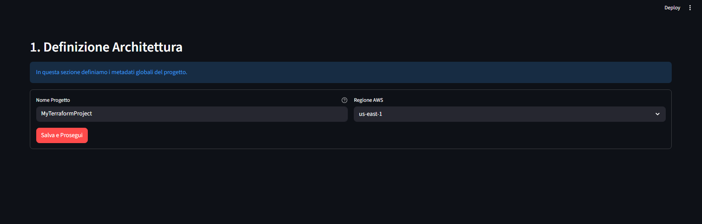
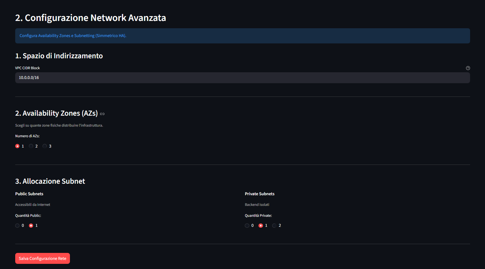
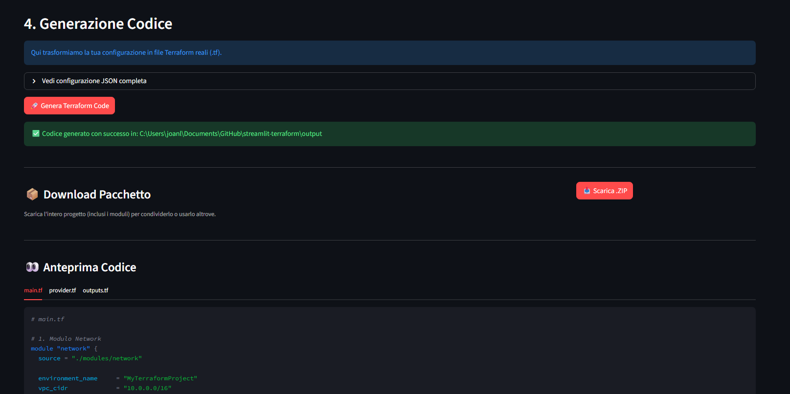

# Terraform Studio

Una webapp interattiva basata su **Streamlit** per generare e gestire file **Terraform** in modo visuale, senza scrivere codice manualmente.

## Descrizione

Terraform Studio è uno strumento visuale che permette di:
- **Configurare l'infrastruttura AWS** (VPC, Subnet, istanze EC2)
- **Generare automaticamente file Terraform** pronti all'uso
- **Visualizzare l'architettura** in tempo reale
- **Eseguire terraform plan** per verificare le modifiche
- **Gestire progetti multipli** con salvataggio dello stato

## Caratteristiche Principali

### 1. **Control Center**
La pagina principale mostra:
- **KPI Dashboard**: Metriche del progetto (Nome, Regione, Disponibilità, Risorse)
- **Network Architecture**: Visualizzazione VPC CIDR, Subnet pubbliche/private
- **Compute & Security**: Specifiche istanze EC2, tipo disco, porte firewall
- **System Readiness**: Status delle credenziali AWS, codice generato, provider init

### 2. **Configurazione Progetto**
Pagina "Architecture" per definire:
- Nome progetto
- Regione AWS
- Numero di Availability Zone (HA)

### 3. **Configurazione Rete**
Pagina "Network Module" per configurare:
- VPC CIDR block
- Subnet pubbliche e private
- Security groups
- Route tables

### 4. **Configurazione Compute**
Pagina "EC2 Module" per definire:
- Tipo di istanza
- AMI ID
- Numero istanze
- Tipo e dimensioni disco
- Porte aperte e firewall
- User data script

### 5. **Visualizzazione Codice**
Pagina "Generated Code" mostra:
- File Terraform generati (main.tf, providers.tf, outputs.tf)
- Moduli (network, ec2)
- Possibilità di scaricare il codice

### 6. **Terraform Plan**
Pagina "Terraform Plan" per:
- Eseguire `terraform init` e `terraform plan`
- Verificare le modifiche prima di applicarle
- Consultare i log di esecuzione
- Calcolo dei costi tramite Infracost (necessià di API Key)


## Requisiti

- Python 3.8+
- pip o uv (gestore pacchetti)
- Credenziali AWS configurate
- Docker 


## Installazione

### 1. Clonare il repository
```bash
git clone <url-repository>
cd streamlit-terraform
```

### 2. Installare le dipendenze
```bash
pip install -r requirements.txt
```

Oppure con **uv** (più veloce):
```bash
uv sync
```

### 3. Configurare le credenziali AWS
Impostare le variabili di ambiente:
```bash
export AWS_ACCESS_KEY_ID=your_access_key
export AWS_SECRET_ACCESS_KEY=your_secret_key
```

Oppure creare un file `.env`:
```
AWS_ACCESS_KEY_ID=your_access_key
AWS_SECRET_ACCESS_KEY=your_secret_key
AWS_DEFAULT_REGION=us-east-1
```

## Utilizzo

### Avviare l'app
```bash
streamlit run app/Terraform_Generator.py
```

Oppure con **uv**:
```bash
uv run streamlit run app/Terraform_Generator.py
```

L'app si aprirà a `http://localhost:8501`

### Workflow tipico

1. **Accedi** usando le credenziali (se abilitato nella sidebar)
2. **Configura l'architettura** nella pagina Architecture
3. **Imposta la rete** nella pagina Network Module
4. **Configura le istanze** nella pagina EC2 Module
5. **Visualizza il codice** in Generated Code
6. **Genera il piano** in Terraform Plan
7. **Scarica il codice** o applica direttamente

## Struttura del Progetto

```
streamlit-terraform/
├── app/
│   ├── Terraform_Generator.py    # Main app
│   └── pages/
│       ├── 1_Architecture.py      # Configurazione progetto
│       ├── 2_Network_Module.py    # Configurazione rete
│       ├── 3_EC2_Module.py        # Configurazione compute
│       ├── 3_Generated_Code.py    # Visualizza codice
│       └── 4_Terraform_Plan.py    # Esegui plan
├── core/
│   ├── auth_sidebar.py            # Autenticazione
│   ├── state_manager.py           # Gestione stato sessione
│   ├── models.py                  # Modelli dati
│   ├── template_renderer.py       # Rendering template Jinja2
│   ├── terraform_builder.py       # Build Terraform files
│   ├── terraform_runner.py        # Esecuzione terraform
│   └── project_writer.py          # Salvataggio progetti
├── templates/
│   ├── root/                      # Template root modules
│   └── modules/
│       ├── ec2/                   # Template EC2 module
│       └── network/               # Template network module
├── output/                        # Terraform files generati
└── requirements.txt               # Dipendenze Python
```

## Tecnologie Utilizzate

- **Streamlit**: Framework per UI web interattiva
- **Terraform**: Infrastructure as Code
- **Jinja2**: Template engine per generare codice Terraform
- **AWS SDK**: Interazione con AWS

## Note Tecniche

- Lo stato dell'app è gestito in `st.session_state` per persistenza durante la sessione
- I file Terraform sono generati nella cartella `output/`
- I template Jinja2 sono in `templates/` e vengono renderizzati dinamicamente
- L'autenticazione è opzionale e configurabile in `core/auth_sidebar.py`

## Screenshot

### 1. Home - Control Center
Dashboard principale con metriche, architettura di rete e status di sistema.


### 2. Architecture Configuration
Pagina per configurare il progetto e le availability zone.


### 3. Network Module
Configurazione della VPC, subnet e security groups.



### 4. EC2 Module
Configurazione delle istanze EC2, storage e firewall.



### 5. Generated Code
Visualizzazione del codice Terraform generato.


### 6. Terraform Plan Execution
Esecuzione di terraform init e plan.



---

**Per semplificare la gestione dell'infrastruttura AWS**
