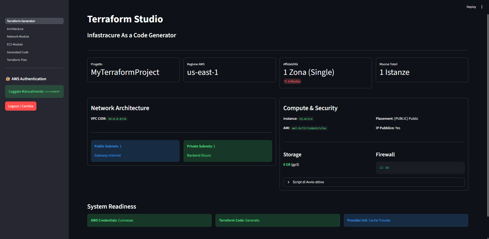

# Terraform Studio (Multi-Cloud Edition)

Una webapp interattiva basata su **Streamlit** per generare e gestire file **Terraform** in modo visuale per **AWS** e **Google Cloud Platform (GCP)**.

## Descrizione

Terraform Studio è uno strumento visuale che permette di:
- **Configurare l'infrastruttura Multi-Cloud** (AWS VPC/EC2 o GCP Network/Compute)
- **Generare automaticamente file Terraform** pronti all'uso per il provider selezionato
- **Visualizzare l'architettura** in tempo reale con dashboard dinamiche
- **Eseguire terraform plan & apply** direttamente dall'interfaccia (Docker-based)
- **Gestire l'autenticazione** in modo sicuro (AWS Keys o GCP Service Accounts)

## Caratteristiche Principali

### 1. **Multi-Cloud Control Center**
La dashboard si adatta al provider selezionato:
- **AWS**: KPI regionali, Availability Zones, ALB, RDS.
- **GCP**: Project ID, Region, Network globale, Compute Engine.

### 2. **Gestione Identità & Sicurezza**
- **AWS**: Supporto per Access Key / Secret Key (manuali o da `.env`).
- **GCP**: Upload sicuro di **JSON Service Account Key** (salvate temporaneamente in sessione/locali protetti).

### 3. **Configurazione Rete (VPC)**
- **AWS**: CIDR Block, Subnet Pubbliche/Private, NAT Gateways (simulati logicamente).
- **GCP**: Custom VPC, Subnet Regionali, Cloud NAT (per istanze private), Firewall Rules (con target tags).

### 4. **Compute Module**
- **AWS EC2**: Scelta istanza (t2/t3), AMI, Key Pair, Security Groups.
- **GCP Compute Engine**: Machine Type (e2, n1), Image Family, Zone, IP Pubblico (effimero) o Privato.

### 5. **Generazione e Deploy**
- **Codice Pulito**: Genera file `.tf` modulari e leggibili basati su template Jinja2.
- **Terraform Runner**: Esegue `init`, `plan`, `apply` e `destroy` all'interno di container Docker effimeri per garantire isolamento e sicurezza.
- **Stima Costi**: Integrazione con **Infracost** per previsioni di spesa.

## Requisiti

- Python 3.8+
- pip o uv (gestore pacchetti)
- Docker (per eseguire Terraform e Infracost)
- Credenziali Cloud (AWS Access Keys o GCP JSON Key)

## Installazione

### 1. Clonare il repository
```bash
git clone <url-repository>
cd streamlit-terraform
```

### 2. Installare le dipendenze
Con **uv** (consigliato):
```bash
uv sync
```
Oppure pip:
```bash
pip install -r requirements.txt
```

### 3. Struttura Cartelle (Nuova)
Il progetto separa nettamente i template per facilitare l'estensione:
```
templates/
├── aws/          # Logica AWS (EC2, VPC, ALB, RDS)
└── gcp/          # Logica GCP (Compute, Network)
```

## Utilizzo

### Avviare l'app
```bash
uv run streamlit run app/Terraform_Generator.py
```
L'app si aprirà a `http://localhost:8501`.

### Workflow Multi-Cloud

1.  **Select Provider**: Dalla sidebar, scegli **AWS** o **GCP**.
2.  **Authenticate**:
    *   **AWS**: Inserisci le chiavi o usa `.env`.
    *   **GCP**: Carica il file JSON della Service Account e imposta il Project ID.
3.  **Configure**: Naviga le pagine (Network, Compute) che si adatteranno al provider scelto.
4.  **Generate**: Vai su "Generated Code" per creare i file Terraform.
5.  **Plan & Deploy**: Vai su "Terraform Plan" per eseguire il deploy reale.

## Struttura del Progetto

```
streamlit-terraform/
├── app/
│   ├── Terraform_Generator.py     # Main Entrypoint & Dashboard
│   └── pages/                     # Pagine Modulari (Architecture, Network, ecc.)
├── core/
│   ├── auth_sidebar.py            # Gestione Auth (AWS/GCP)
│   ├── models.py                  # Pydantic Models (Discriminated Unions)
│   ├── terraform_runner.py        # Wrapper Docker per Terraform
│   └── ...
├── templates/
│   ├── aws/                       # Jinja2 Templates AWS
│   └── gcp/                       # Jinja2 Templates GCP
├── output/                        # Artefatti generati
└── .secrets/                      # Cartella sicura per chiavi temporanee (git-ignored)
```

## Screenshot (AWS)

### 1. Home - Control Center


### 2. Architecture Configuration


*(Ulteriori screenshot disponibili nella cartella screenshots/)*
